# 🍯 Windows Honeytoken CI/CD Security Tool


> Advanced Windows-optimized honeytoken system with integrated CI/CD pipeline support, research-based enhancements, and real-time detection capabilities.

## 🎯 Project Overview

This project implements a comprehensive honeytoken security system specifically designed for Windows environments and CI/CD pipelines. It incorporates cutting-edge research from 5 academic papers to provide advanced features like fingerprinting resistance, AI-enhanced detection, and dynamic scaling.

### 🔬 Research Paper Implementations

| Paper | Enhancement | Status |
|-------|-------------|---------|
| **Msaad et al. (2023)** | Fingerprinting Resistance | ✅ Implemented |
| **Saleh et al. (2024)** | AI-Enhanced Detection | ✅ Implemented |
| **Reti et al. (2024)** | Context-Aware Generation | ✅ Implemented |
| **Flora et al. (2023)** | Microservice Scaling | ✅ Implemented |
| **Database Paper (2024)** | Hierarchical Management | ✅ Implemented |

## 🚀 Quick Start

### Prerequisites
- Windows 10/11 or Windows Server 2019/2022
- Python 3.8+ (3.11 recommended)
- Administrative privileges (for registry operations)

### Installation

```bash
# Clone repository
git clone https://github.com/your-org/windows-honeytoken-tool.git
cd windows-honeytoken-tool

# Install dependencies
pip install -r requirements.txt
pip install -r web_requirements.txt

# Run comprehensive demo
python src/windows_cli.py demo
```

### 🎬 Interactive Demo

```bash
# One-click demo with all features
python src/windows_cli.py demo

# Launch web dashboard
python src/windows_cli.py web

# Simulate attack scenario
python src/windows_cli.py simulate-attack
```

## 🌟 Key Features

### 🔑 **Token Generation**
- **9 Token Types**: API keys, JWT tokens, database URLs, AWS keys, Azure tokens, GitHub tokens, SQL connections, registry keys, PowerShell variables
- **Fingerprint Resistance**: Dynamic patterns and randomization
- **Context-Aware**: Adapts to deployment environment

### 💉 **Injection Methods**
- **PowerShell Scripts**: Embedded variables and encoded tokens
- **Windows Registry**: HKEY entries with monitoring
- **SQL Server**: Database table integration
- **Environment Variables**: System and user-level variables
- **Configuration Files**: JSON, XML, YAML injection

### 🔍 **Detection & Monitoring**
- **Enhanced Detection**: Advanced anomaly detection
- **Windows Event Log**: Native logging integration
- **Real-time Alerts**: Email, Slack, Teams, webhook notifications
- **PowerShell History**: Command monitoring
- **Process Tracking**: Unauthorized access detection

### 🌐 **Web Dashboard**
- **Interactive UI**: Token management and visualization
- **Live Status**: Real-time monitoring dashboard
- **Test Cases**: Built-in demo scenarios
- **Export/Import**: Configuration management
- **Charts & Reports**: Detection analytics

## 🏗️ Architecture

```mermaid
graph TB
    A[Generator] --> B[Injector]
    B --> C[Detector]
    C --> D[Orchestrator]
    D --> E[Web Dashboard]
    
    A --> F[Token Types<br/>• API Keys<br/>• JWT Tokens<br/>• Database URLs]
    B --> G[Injection Points<br/>• PowerShell<br/>• Registry<br/>• SQL Server]
    C --> H[Detection Methods<br/>• AI Analysis<br/>• Event Logs<br/>• Process Monitor]
    D --> I[Pipeline Integration<br/>• Build Stage<br/>• Test Stage<br/>• Deploy Stage]
```



## 📚 Command Reference

### Core Commands

```bash
# Initialize configuration
python src/windows_cli.py init

# Deploy to pipeline stage
python src/windows_cli.py deploy --stage build
python src/windows_cli.py deploy --stage test
python src/windows_cli.py deploy --stage deploy

# Monitor for triggers
python src/windows_cli.py monitor

# Check status
python src/windows_cli.py status --format json

# Generate report
python src/windows_cli.py report --output security_report.json
```

### Advanced Commands

```bash
# Run comprehensive tests
python src/windows_cli.py test --coverage

# Launch web interface
python src/windows_cli.py web --port 5000

# Simulate attack
python src/windows_cli.py simulate-attack --token-id abc123

# Export configuration
python src/windows_cli.py export --format json --output config.json

# Setup alerts
python src/windows_cli.py setup-alerts --type email --config-alert '{"smtp_server": "smtp.gmail.com"}'

# Show research features
python src/windows_cli.py research-features

# Import configuration
python src/windows_cli.py import-config --file exported_config.json
```

## 🧪 Testing & Validation

### Test Suite Coverage
- ✅ **Unit Tests**: 95%+ code coverage
- ✅ **Integration Tests**: End-to-end workflows  
- ✅ **Performance Tests**: Load and stress testing
- ✅ **Security Tests**: Vulnerability scanning
- ✅ **Windows-Specific Tests**: Registry, Event Log, PowerShell

### Running Tests

```bash
# Run all tests
python src/windows_cli.py test

# Run with coverage report
python src/windows_cli.py test --coverage

# Run specific test categories
python -m pytest tests/test_comprehensive.py::TestWindowsSpecificFeatures -v
```

## 🔄 CI/CD Integration

### GitHub Actions
```yaml
- name: Deploy Honeytokens
  run: |
    python src/windows_cli.py deploy --stage build
    python src/windows_cli.py monitor &
```

### Azure DevOps
```yaml
- script: |
    pip install -r requirements.txt
    python src/windows_cli.py deploy --stage $(Build.SourceBranchName)
  displayName: 'Deploy Honeytokens'
```

### Jenkins
```groovy
pipeline {
    agent { label 'windows' }
    stages {
        stage('Deploy Honeytokens') {
            steps {
                bat 'python src/windows_cli.py deploy --stage build'
            }
        }
    }
}
```

## 🎯 Demo Scenarios

### Scenario 1: API Key Injection
```bash
# Generate and inject API key honeytoken
python src/windows_cli.py demo
# → Creates PowerShell script with embedded API key
# → Monitors for unauthorized access
# → Triggers alert when accessed
```

### Scenario 2: Database Attack Simulation
```bash
# Deploy SQL honeytoken and simulate attack
python src/windows_cli.py deploy --stage test
python src/windows_cli.py simulate-attack
# → Shows detection and alerting in action
```

### Scenario 3: Multi-Stage Pipeline
```bash
# Deploy across all pipeline stages
python src/windows_cli.py deploy --stage build
python src/windows_cli.py deploy --stage test  
python src/windows_cli.py deploy --stage deploy
# → Demonstrates scaling and management
```

## 📊 Sample Outputs

### Status Report
```json
{
  "platform": "Windows 11",
  "active_tokens": 15,
  "monitoring_active": true,
  "research_enhancements": {
    "fingerprint_resistance": true,
    "ai_detection": true,
    "context_aware_generation": true,
    "microservice_scaling": true,
    "hierarchical_management": true
  },
  "detection_summary": {
    "total_detections": 3,
    "triggered_tokens": 2,
    "severity_breakdown": {
      "HIGH": 1,
      "MEDIUM": 2,
      "LOW": 0
    }
  }
}
```

### PowerShell Injection Code
```powershell
# Windows Honeytoken PowerShell Injection
# Token ID: a1b2c3d4 | Type: api_key
# Created: 2024-01-15T10:30:00Z

$honey_var_x9f2 = 'c2staG9uZXlfdG9rZW5fYWJjZGVmZ2hpams='
$decoded = [System.Text.Encoding]::UTF8.GetString([System.Convert]::FromBase64String($honey_var_x9f2))

# Log to Windows Event Log
Write-EventLog -LogName "Application" -Source "HoneytokenApp" -EventId 1001 -EntryType Information -Message "Honeytoken accessed: $decoded"

# Monitor usage
$global:HoneytokenUsage = @{
    TokenId = "a1b2c3d4"
    AccessTime = Get-Date
    ProcessId = $PID
    UserName = $env:USERNAME
}
```

## 🛡️ Security Considerations

### Best Practices
- ✅ Run with minimal required privileges
- ✅ Regularly rotate honeytokens
- ✅ Monitor detection logs
- ✅ Keep alert systems updated
- ✅ Test detection mechanisms regularly

### Privacy & Compliance
- 🔒 No sensitive data collection
- 📋 GDPR compliant logging
- 🛡️ Encrypted token storage
- 📊 Audit trail maintenance

## 🚀 Advanced Configuration

### Custom Token Types
```json
{
  "custom_tokens": {
    "my_api_key": {
      "template": "myapp_{random_string}",
      "length": 32,
      "expiry_hours": 48
    }
  }
}
```

### Alert Configuration
```json
{
  "alerting": {
    "email": {
      "smtp_server": "smtp.company.com",
      "port": 587,
      "recipients": ["security@company.com"]
    },
    "slack": {
      "webhook_url": "https://hooks.slack.com/...",
      "channel": "#security-alerts"
    }
  }
}
```

## 🤝 Contributing

### Development Setup
```bash
# Clone and setup development environment
git clone https://github.com/your-org/windows-honeytoken-tool.git
cd windows-honeytoken-tool

# Create virtual environment
python -m venv venv
venv\Scripts\activate

# Install development dependencies
pip install -r requirements.txt
pip install pytest pytest-cov black flake8

# Run tests
python -m pytest tests/ -v
```

### Contribution Guidelines
1. 🍴 Fork the repository
2. 🌿 Create feature branch (`git checkout -b feature/amazing-feature`)
3. 🧪 Add tests for new functionality
4. ✅ Ensure all tests pass
5. 📝 Update documentation
6. 🚀 Submit pull request

## 📈 Roadmap

### Version 2.0 (Q2 2024)
- [ ] Docker container support
- [ ] Linux compatibility layer
- [ ] Advanced visualization dashboard
- [ ] API endpoint exposure

### Version 2.1 (Q3 2024)
- [ ] Kubernetes integration
- [ ] Cloud provider templates (AWS, Azure, GCP)
- [ ] Mobile dashboard app  
- [ ] Advanced analytics platform
- [ ] Multi-tenant support

## 📄 License

This project is licensed under the MIT License - see the [LICENSE](LICENSE) file for details.

## 🙏 Acknowledgments

- Research papers that informed this implementation
- Windows security community for feedback
- Open source contributors
- Academic researchers in honeypot technology

## 📞 Support

- 📧 **Email**: security@company.com
- 💬 **Slack**: #honeytoken-support
- 🐛 **Issues**: [GitHub Issues](https://github.com/your-org/windows-honeytoken-tool/issues)
- 📖 **Documentation**: [Wiki](https://github.com/your-org/windows-honeytoken-tool/wiki)

---

<div align="center">

**🍯 Secure your Windows CI/CD pipelines with intelligent honeytokens**

[](https://github.com/your-org/windows-honeytoken-tool/stargazers)
[](https://github.com/your-org/windows-honeytoken-tool/network)
[](https://github.com/your-org/windows-honeytoken-tool/issues)

</div>
